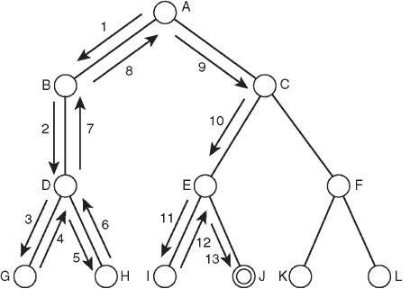
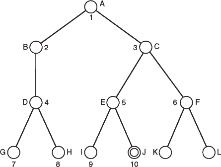

# Resumo do conteúdo - Kalebe Silva

# Metodologias de Busca

_Pesquisa é o processo de percorrer vielas para ver se elas são sem saída. (Marston Bates)_

_Quando uma coisa é engraçada, busque-a cuidadosamente por uma verdade escondida. (George Bernard Shaw)_

_Se não acharmos qualquer coisa agradável, pelo menos acharemos algo novo. (Voltaire, Candide)_

_Aquele que pede, recebe; e, o que procura, encontra. (O Evangelho segundo São Mateus, Capítulo 7, Versículo 8)_

## Introdução

No Capítulo 3 foram apresentados árvores de busca e outros métodos e representações que são utilizados para solucionar problemas por meio de técnicas de Inteligência Artificial, tais como busca. No Capítulo 4 apresentamos diversos métodos que podem ser utilizados para busca e discutimos quão efetivos eles são em diferentes situações. Busca em profundidade e busca em largura são os métodos de busca mais conhecidos e amplamente utilizados e, neste capítulo, examinamos porque e como eles são implementados. Também veremos diversas propriedades dos métodos de busca, incluindo o ser ótimo e a completude, que podem ser utilizados para determinar quão útil um método de busca será ao solucionar um determinado problema.

Os métodos que são descritos neste capítulo e no Capítulo 5 têm impacto em quase todo aspecto da Inteligência Artificial. Por causa da natureza sequencial, na qual computadores tendem a operar, a busca é necessária para determinar soluções para uma enorme gama de problemas.

Este capítulo começa discutindo métodos de busca cega e prossegue examinando métodos de busca informados – esses métodos de busca utilizam heurísticas para examinar um espaço de busca mais eficientemente.

### Solução de problemas como busca

Solução de problemas é um importante aspecto da Inteligência Artificial. Um problema pode ser considerado como consistindo em um objetivo e um conjunto de ações que podem ser praticadas para alcançar esse objetivo. Em qualquer tempo, consideramos o estado do espaço de busca para representar aonde chegamos como um resultado das ações aplicadas até então.

Por exemplo, consideremos o problema de procurar as lentes de contato no campo de futebol. O estado inicial é como começamos, ou seja, sabemos que as lentes estão em algum lugar no campo de futebol, mas não sabemos aonde. Se utilizarmos a representação na qual examinamos o campo em unidades de um centímetro quadrado, então nossa primeira ação será examinar o quadrado no canto superior esquerdo do campo. Se não acharmos as lentes lá, podemos considerar o estado agora como sendo examinamos o quadrado do canto superior esquerdo e não achamos as lentes. Depois de várias ações, o estado deverá ser que examinamos 500 quadrados e agora encontramos as lentes no último quadrado examinado. Esse é um estado objetivo, pois ele satisfaz a meta que tínhamos de encontrar as lentes de contato.

Busca é um método que pode se utilizado por computadores para examinar um espaço de problema, como esse, de modo a encontrar um objetivo. Frequentemente, queremos encontrar o objetivo o mais rápido possível ou sem utilizar muitos recursos. Um espaço de problema também pode ser considerado como espaço de busca, pois, de modo a solucionar o problema, faremos uma busca no espaço por um estado objetivo. Continuaremos utilizando o termo espaço de busca para descrever esse conceito.

Neste capítulo, analisaremos vários métodos para examinar um espaço de busca. Esses métodos são chamados de métodos de busca.

### Busca guiada por dados ou busca guiada por objetivos

Existem duas abordagens principais para fazer busca em uma árvore de busca, que aproximadamente correspondem às abordagens de-cima-para-baixo e de-baixo-para-cima, discutidas na Seção 3.12.1. Busca guiada por dados parte de um estado inicial e usa ações que são permitidas para ir em frente até que um objetivo seja atingido. Essa abordagem também é conhecida como encadeamento para frente.

Alternativamente, a busca pode começar no objetivo e voltar para um estado inicial, vendo quais deslocamentos poderiam ter levado ao estado objetivo. Isso é busca guiada por objetivos, também conhecida como encadeamento para trás.

A maioria dos métodos de busca que examinaremos neste capítulo e no Capítulo 5 é formada por métodos de busca guiada por dados: eles partem de um estado inicial (a raiz na árvore de busca) e trabalham em direção ao nó objetivo.

Em muitas circunstâncias, busca guiada por objetivos é preferível à busca guiada por dados, mas na maior parte do livro, quando nos referirmos a “busca”, estaremos falando de busca guiada por dados.

Busca guiada por objetivos e busca guiada por dados terminam produzindo o mesmo resultado, porém, dependendo da natureza do problema a ser resolvido, um dos métodos pode resolvê-lo mais eficientemente que o outro – em particular, em algumas situações um deles pode envolver examinar mais estados que o outro.

Busca guiada por objetivos é particularmente útil em situações nas quais o objetivo pode ser claramente especificado (por exemplo, um teorema a ser provado ou encontrar uma saída em um labirinto). É também, sem dúvida, a melhor escolha em problemas como diagnósticos médicos onde o objetivo (a condição a ser diagnosticada) é conhecido, mas os outros dados (neste caso, as causas da condição) precisam ser encontrados.

Busca guiada por dados é mais útil quando os dados iniciais são fornecidos e não temos clareza sobre o objetivo. Por exemplo, um sistema que analise dados astronômicos e, assim, faça deduções sobre a natureza de estrelas e planetas, receberia um grande volume de dados, mas não necessariamente lhe seria dado um objetivo direto. Em vez disso, seria esperado que analisasse os dados e tirasse suas próprias conclusões. Esse tipo de sistema tem um imenso número de possíveis objetivos que poderia localizar. Neste caso, busca guiada por dados é mais apropriada.

É interessante considerar um labirinto que tenha sido criado para ser percorrido de um ponto inicial de modo a chegar a um ponto final específico. É quase sempre mais fácil começar do ponto final e voltar ao ponto inicial. Isso se deve aos diversos caminhos sem saída que foram estabelecidos desde o ponto inicial (dados) e somente um caminho que foi estabelecido para o ponto final (objetivo). Como resultado, vir do objetivo ao início tem somente um caminho possível.

### Gerar e testar

A mais simples abordagem de busca é chamada Gerar e Testar. Isto envolve simplesmente gerar cada nó no espaço de busca e testá-lo para verificar se este é um nó objetivo. Se for, a busca teve sucesso e não precisa ser levada adiante. Caso contrário, o procedimento segue para o próximo nó.

Essa é a forma mais simples de busca de força bruta (também chamada de busca exaustiva), assim chamada porque ela não pressupõe conhecimento adicional além de como percorrer a árvore de busca e como identificar nós folhas e nós objetivos, que terminará por examinar cada nó da árvore até encontrar um objetivo.

Para ter sucesso, Gerar e Testar precisa ter um Gerador adequado, que deve satisfazer a três propriedades:

1.Ele deve ser completo: em outras palavras, ele deve gerar todas as soluções possíveis; caso contrário, poderia descartar uma solução adequada.

2.Ele não deve ser redundante: isso significa que não deve gerar a mesma solução duas vezes.

3.Ele deve ser bem informado: isso significa que só deve propor soluções adequadas e não deve examinar possíveis soluções que não combinem com o espaço de busca.

O método Gerar e Testar pode ser aplicado com sucesso a diversos problemas e, na verdade, é o modo pelo qual as pessoas frequentemente solucionam problemas onde não há informação adicional sobre como alcançar uma solução. Por exemplo, se você sabe que um amigo mora em uma determinada rua, mas não sabe em qual casa, a abordagem Gerar e Testar poderia ser necessária; isto envolveria tocar a campainha de cada casa da rua até você achar seu amigo. De modo análogo, Gerar e Testar pode ser utilizado para achar soluções para problemas combinatórios como o problema das oito rainhas que é apresentado no Capítulo 5.

Gerar e Testar é também, algumas vezes, referido como uma técnica de busca cega, devido ao modo pelo qual a árvore de busca é percorrida, sem utilizar qualquer informação sobre o espaço de busca.

Exemplos mais sistemáticos de busca de força bruta são apresentados neste capítulo, em particular, busca em profundidade e busca em largura.

Técnicas de busca mais “inteligentes” (ou informadas) serão exploradas mais tarde neste capítulo.

### Busca em profundidade

Um algoritmo comumente utilizado é busca em profundidade. Busca em profundidade é assim chamada por seguir cada caminho até a sua maior profundidade antes de seguir para o próximo caminho. O princípio subjacente à busca em profundidade é ilustrado na Figura 4.1. Supondo que comecemos pelo lado esquerdo e sigamos para o lado direito, a busca em profundidade envolve descer pelo caminho mais à esquerda na árvore até achar uma folha. Se este for um estado objetivo, a busca foi concluída e será relatado sucesso.

Se a folha não representar um estado objetivo, a busca retrocederá ao primeiro nó anterior que tenha um caminho não explorado. Na Figura 4.1, após examinar o nó G e descobrir que este não é um objetivo, a busca retrocede ao nó D e explora seus outros filhos. Neste caso, só há um outro filho, que é H. Depois que este nó for examinado, a busca retrocederá ao próximo nó não expandido, que é A, pois B não tem filhos não explorados.

Demonstrando busca em profundidade

Esse processo continua até que todos os nós tenham sido examinados, caso em que a busca termina com falha, ou até que um estado objetivo tenha sido alcançado, caso em que a busca termina com sucesso. Na Figura 4.1, a busca termina no nó J, que é o nó objetivo. Como resultado, os nós F, K e L não foram examinados.

Busca em profundidade utiliza um método chamado de retrocesso cronológico para voltar na árvore de busca, uma vez que um caminho sem saída seja encontrado. Retrocesso cronológico é assim chamado porque ele desfaz escolhas em ordem contrária ao momento em que as decisões foram originalmente tomadas. Veremos adiante neste capítulo que retrocesso não cronológico, no qual escolhas são desfeitas de uma forma mais ordenada, pode ajudar a resolver certos problemas.

Busca em profundidade é um exemplo de busca de força bruta ou busca exaustiva.

Busca em profundidade é bem utilizada por computadores para problemas de busca do tipo como localizar um arquivo em um disco ou por motores de busca do tipo para indexação (spidering) na Internet.

Como qualquer pessoa que tenha utilizado a operação localizar em seu computador sabe, a busca em profundidade pode ter problemas. Em especial, se um ramo da árvore de busca for muito grande, ou mesmo infinito, então o algoritmo de busca gastará uma quantidade descomedida de tempo examinando este ramo, que poderá nunca levar a um estado objetivo.

### Busca em Largura

Uma alternativa à busca em profundidade é a busca em largura. Como o próprio nome sugere, essa abordagem envolve percorrer a árvore em largura em vez de em profundidade. Como pode ser visto na Figura 4.2, o algoritmo de busca em largura começa examinando todos os nós um nível (algumas vezes chamado de uma camada) abaixo do nó raiz.

Se um estado objetivo for encontrado aqui, é relatado sucesso. Caso contrário, a busca prossegue pela expansão de caminhos a partir de todos os nós do nível corrente na direção do próximo nível. Desse modo, a busca continua examinando nós em um determinado nível, relatando sucesso quando um nó objetivo for encontrado e relatando falha se todos os nós tiverem sido examinados e um nó objetivo não tiver sido encontrado.

Busca em largura é um método bem melhor para utilizar em situações nas quais a árvore pode ter caminhos muitos profundos, principalmente se o nó objetivo estiver em uma parte mais rasa da árvore. Infelizmente, ela não funciona tão bem quando o fator de ramificação da árvore é muito alto, tais como ao examinar árvores de jogos para jogos como Go e Xadrez (veja o Capítulo 6 para mais detalhes sobre árvores de jogos).

Busca em largura não é uma boa ideia em árvores onde todos os caminhos levam a um nó objetivo com caminhos de comprimentos parecidos. Em situações como esta, a busca em profundidade funciona muito melhor, pois identificaria um nó objetivo quando atingisse o final do primeiro caminho examinado.

### Comparação das buscas em profundidade e em largura

|Cenário | Busca em profundidade | Busca em largura|
|:---|:---|:---|
|Alguns caminhos são muito longos ou funciona mal funciona funciona bem mesmos infinitos | Funciona mal | Funciona bem |
|Todos Os caminhos tem comprimentos funciona bem funciona parecidos | funciona bem | funciona bem |
|Todos os caminhos têm comprimentos Funciona bem Desperdício de tempo e memória parecidos e todos os caminhos levam a um estado objetivo| funciona bem | Desperdício de tempo e memória |
|Alto fator de ramificação | 	
O desempenho depende de Funciona precariamente outros fatores | Funciona precariamente |

As vantagens comparativas das buscas em profundidade e em largura são mostradas na Tabela 4.1.

Como será visto na próxima seção, a busca em profundidade é geralmente mais fácil de implementar que a busca em largura e, normalmente, exige menos uso de memória, pois somente precisa armazenar informação sobre o caminho que está sendo explorado, enquanto a busca em largura precisa armazenar informação sobre todos os caminhos que atingem a profundidade corrente. Esta é uma das principais razões pela qual a busca em profundidade é amplamente utilizada na solução de problemas computacionais cotidianos.

O problema de caminhos infinitos pode ser evitado na busca em profundidade pela aplicação de um limiar de profundidade. Isso significa que um caminho será considerado como terminado quando for atingida uma profundidade específica. Isto tem a desvantagem de alguns estados objetivos (ou, em alguns casos, o único estado objetivo) poderem ser perdidos, mas assegura que todos os ramos da árvore de busca sejam explorados em um tempo razoável. Como é visto no Capítulo 6, essa técnica é frequentemente utilizada ao examinar árvores de jogos.

### Propriedades dos Métodos de Busca

Como observamos neste capítulo, métodos de busca diferentes trabalham de modos diversos. Há várias propriedades importantes que um método de busca deve ter para ser mais útil.

Em especial, examinaremos as seguintes propriedades:

- Complexidade
- Completude 
- Quanto a ser ótimo
- Admissibilidade
- Irrevogabilidade

### Complexidade 

Ao discutir um método de busca, é útil descrever o quão eficiente ele é em termos de tempo e espaço. A complexidade em termos de tempo de um método está relacionada à duração de tempo que este leva para encontrar um estado objetivo. A complexidade em termos de espaço está relacionada à quantidade de memória que o método precisa utilizar.

É comum utilizar a notação O para descrever a complexidade de um método. Por exemplo, a busca em largura tem complexidade de tempo de O (bd), onde b é o fator de ramificação da árvore e d é a profundidade do nó objetivo na árvore.

Busca em profundidade é muito eficiente em relação a espaço, pois só precisa guardar informações sobre o caminho que está sendo examinado no momento, mas não é eficiente em tempo, pois demora muito examinando ramos muito profundos da árvore.

Obviamente, complexidade é uma importante propriedade a ser compreendida sobre um método de busca. Um método de busca que seja muito ineficiente pode ter um desempenho bem razoável para um pequeno problema de teste, mas diante de um grande problema do mundo real, gastaria um inaceitavelmente longo período de tempo. Como veremos, pode haver uma grande diferença entre o desempenho de dois métodos de busca e selecionar aquele que seja executado mais eficientemente em uma situação específica pode ser muito importante.

Esta complexidade deve ser frequentemente pesada em relação à adequação da solução gerada pelo método. Um método de busca muito rápido nem sempre encontrará a melhor solução, ao passo que, por exemplo, um método de busca que examine cada possível solução garantirá encontrar a melhor solução, mas será muito ineficiente.

### Completude 

Um método de busca é descrito como completo se ele garantir encontrar um estado objetivo, se existir algum. Busca em largura é completa, mas busca em profundidade não é, pois pode explorar um caminho de extensão infinita e nunca achar um nó objetivo que esteja em outro caminho.

Completude é geralmente uma característica desejável, pois utilizar um método de busca que nunca ache uma solução não é frequentemente útil. Por outro lado, pode ser o caso (como ao realizar busca em uma árvore de jogos, durante um jogo, por exemplo) em que pesquisar a árvore de busca inteira não seja necessário, ou simplesmente não seja possível, situação na qual um método que pesquise o suficiente da árvore seria bom o bastante.

Um método que não seja completo tem a desvantagem de não poder ser necessariamente confiável ao relatar que não há solução.

### Quanto a ser ótimo

Um método de busca é ótimo se ele garantir achar a melhor solução que exista. Em outras palavras, ele encontrará o caminho que envolva o menor número de passos até um estado objetivo.

Isso não quer dizer que o método de busca propriamente dito seja eficiente — poderia levar muito tempo para um método ótimo de busca identificar a solução ótima —, mas uma vez que a tenha encontrado, há a garantia de que ela seja a melhor. Isso dá certo se o processo de busca por uma solução consumir menos tempo do que efetivamente implementar a solução. Por outro lado, em alguns casos, implementar a solução depois que ela tenha sido encontrada é muito simples, situação na qual seria melhor utilizar um método de busca mais rápido e não se preocupar se ele encontrou a solução ótima ou não.

Busca em largura é um método ótimo de busca, mas busca em profundidade não é. A busca em profundidade oferece a primeira solução que encontra, que pode ser a pior solução que existe. Devido à busca em largura examinar todos os nós em uma dada profundidade antes de ir para a próxima profundidade, se for encontrada uma solução, não poderá haver outra solução antes dessa na árvore de busca.

Em alguns casos, o termo ótimo é utilizado para descrever um algoritmo que encontre uma solução no menor tempo possível, situação na qual o conceito de admissibilidade é utilizado no lugar de quanto a ser ótimo. Um algoritmo é então definido como admissível se ele garantir encontrar a melhor solução.

### Irrevogabilidade

Métodos que retrocedem são descritos como uma tentativa. Métodos que não retrocedem, e que, portanto, examinam apenas um caminho, são descritos como irrevogáveis. Busca em profundidade é um exemplo de busca por tentativa. Na Seção 4.13 examinamos a subida da colina, um método de busca que é irrevogável.

Métodos de busca irrevogáveis frequentemente encontrarão soluções subótimas para problemas, pois tendem a ser enganados por ótimos locais — soluções que parecem localmente boas, porém, são menos favoráveis quando comparadas com outras soluções em outros lugares do espaço de busca.

